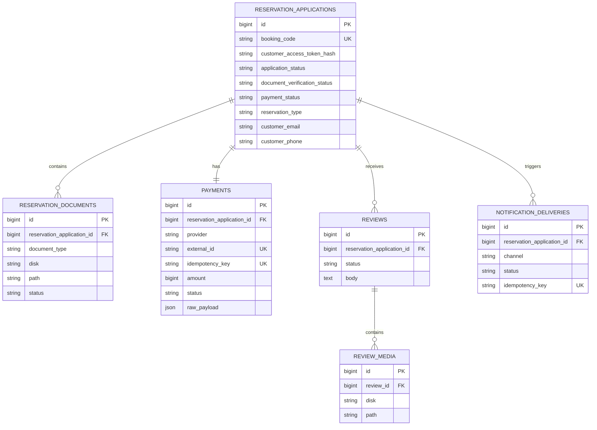

# Reservation ERD

```mermaid
erDiagram
    RESERVATION_APPLICATIONS ||--o{ RESERVATION_DOCUMENTS : contains
    RESERVATION_APPLICATIONS ||--|| PAYMENTS : has
    RESERVATION_APPLICATIONS ||--o{ REVIEWS : receives
    RESERVATION_APPLICATIONS ||--o{ NOTIFICATION_DELIVERIES : triggers
    REVIEWS ||--o{ REVIEW_MEDIA : contains

    RESERVATION_APPLICATIONS {
      bigint id PK
      string booking_code UK
      string customer_access_token_hash
      string application_status
      string document_verification_status
      string payment_status
      string reservation_type
      string customer_email
      string customer_phone
    }
    RESERVATION_DOCUMENTS {
      bigint id PK
      bigint reservation_application_id FK
      string document_type
      string disk
      string path
      string status
    }
    PAYMENTS {
      bigint id PK
      bigint reservation_application_id FK
      string provider
      string external_id UK
      string idempotency_key UK
      bigint amount
      string status
      json raw_payload
    }
    REVIEWS {
      bigint id PK
      bigint reservation_application_id FK
      string status
      text body
    }
    REVIEW_MEDIA {
      bigint id PK
      bigint review_id FK
      string disk
      string path
    }
    NOTIFICATION_DELIVERIES {
      bigint id PK
      bigint reservation_application_id FK
      string channel
      string status
      string idempotency_key UK
    }
```
